# Uplift.ai (Fintinetsy)

Full-stack fitness app: **Flutter** client + **FastAPI** backend.

Connected over REST with:

- **JWT** login/register/logout
- **OAuth2 / OpenID Connect (Google)** → same JWT session
- **Refresh-token rotation** on HTTP 401
- **Hive offline cache** + ETag revalidation
- User-facing network error messages (`ApiException`)

## Demo screenshots

App UI captured on Android emulator. Source files live in [`docs/screenshots/`](docs/screenshots/).

### Onboarding & auth

| Welcome | Sign up |
| :-----: | :-----: |
| 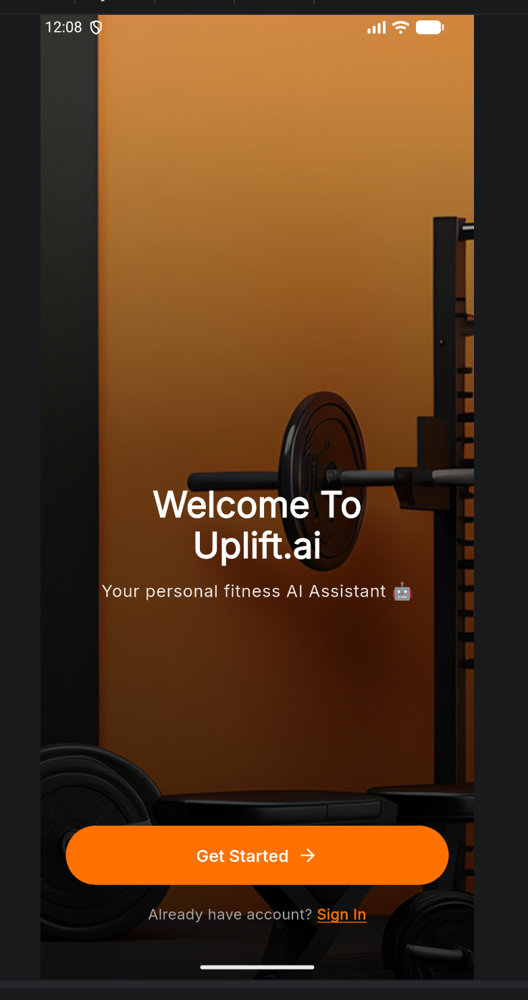 | 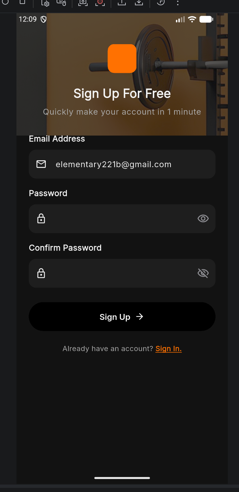 |

### Assessment

| Age | Weight | Fitness level | Vocal | Avatar |
| :-: | :----: | :-----------: | :---: | :----: |
| 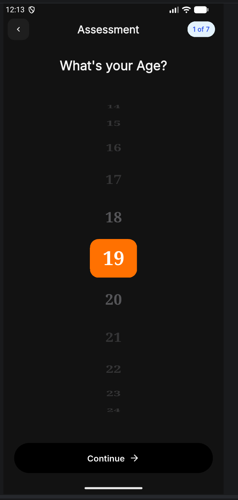 | 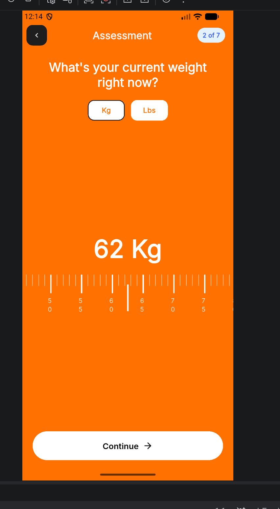 | 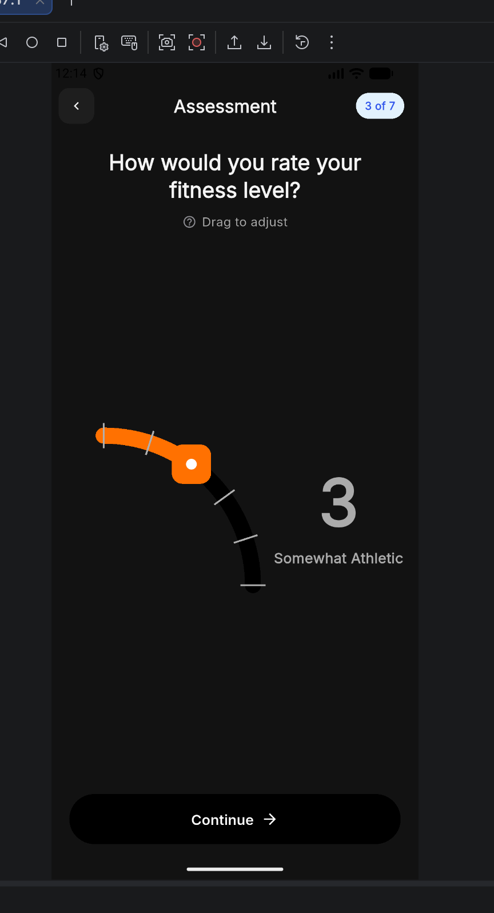 | 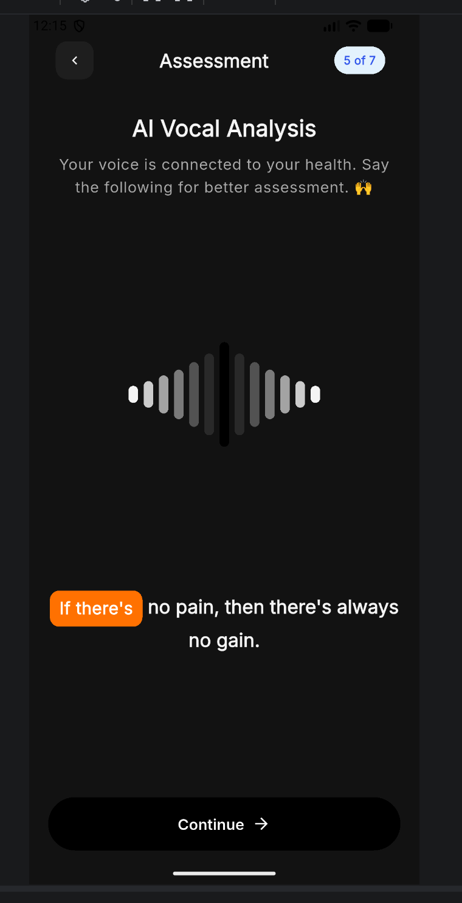 | 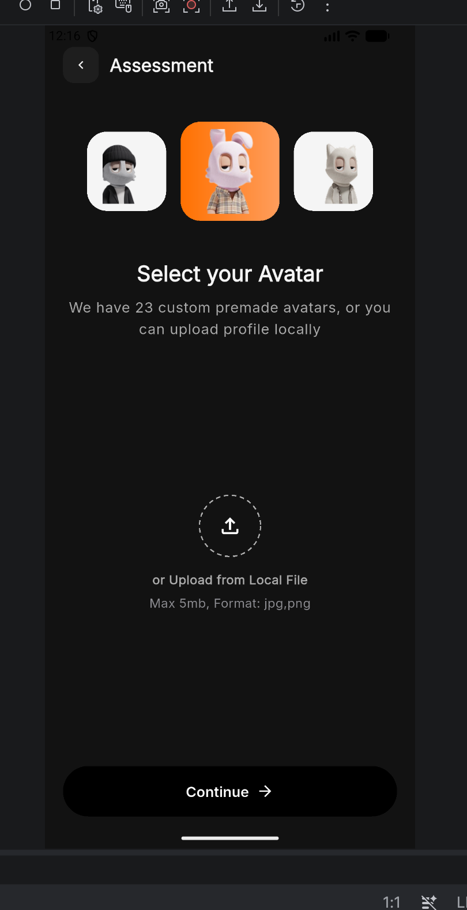 |

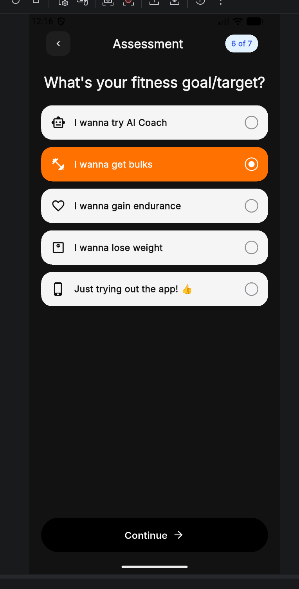

### Home & workouts

| Home | Workout |
| :--: | :-----: |
| 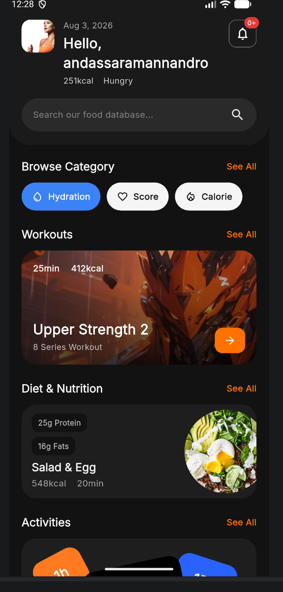 | 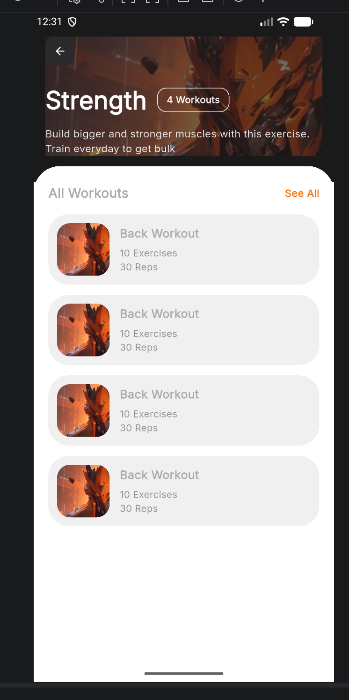 |

### Nutrition, stats & notifications

| Add meal | Calories | Notifications (today) | Notifications (past) |
| :------: | :------: | :-------------------: | :------------------: |
| 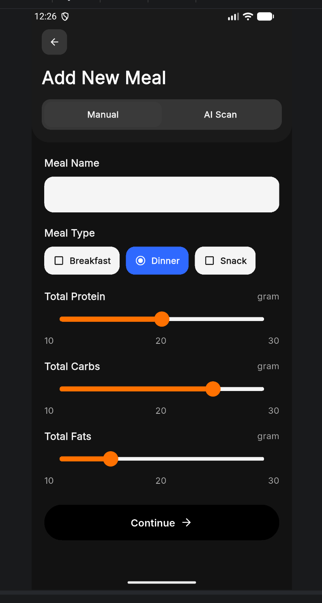 | 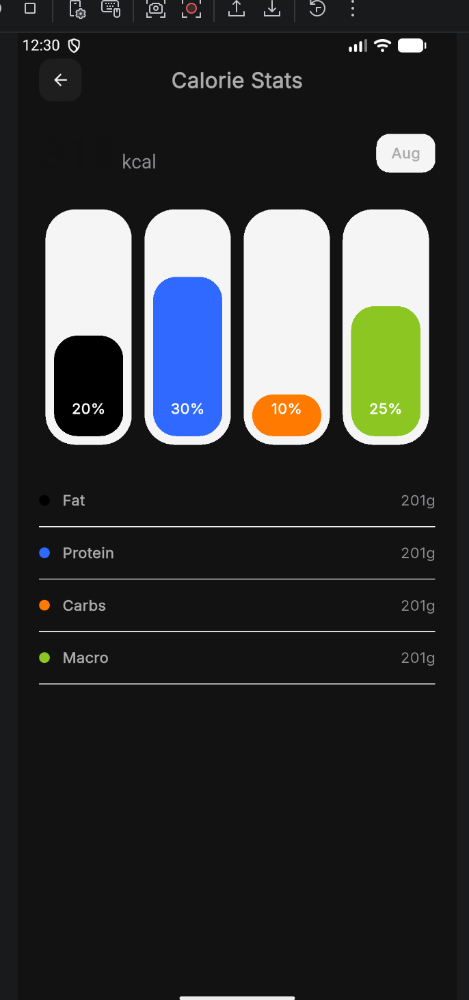 | 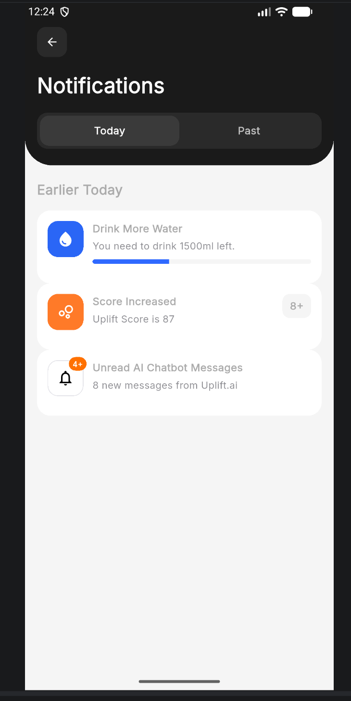 | 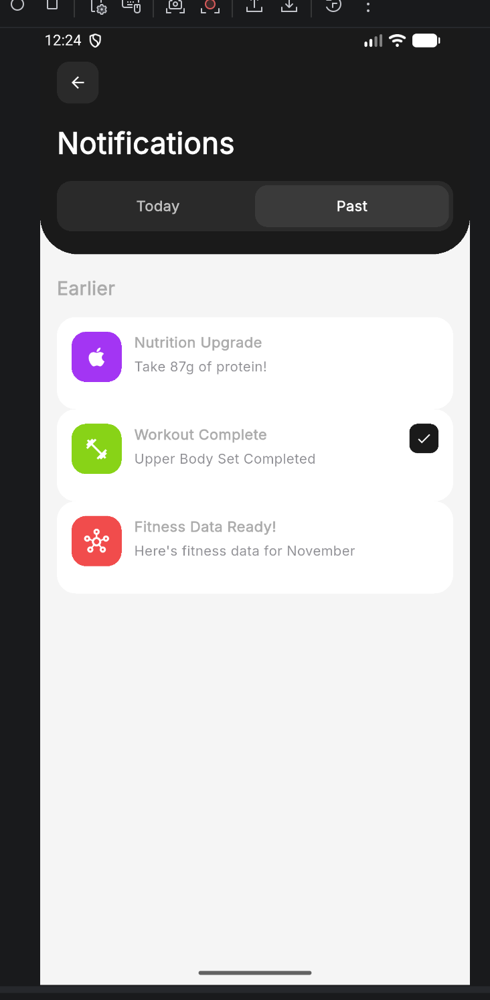 |

### AI coach

| Intro | Assistant |
| :---: | :-------: |
|  | 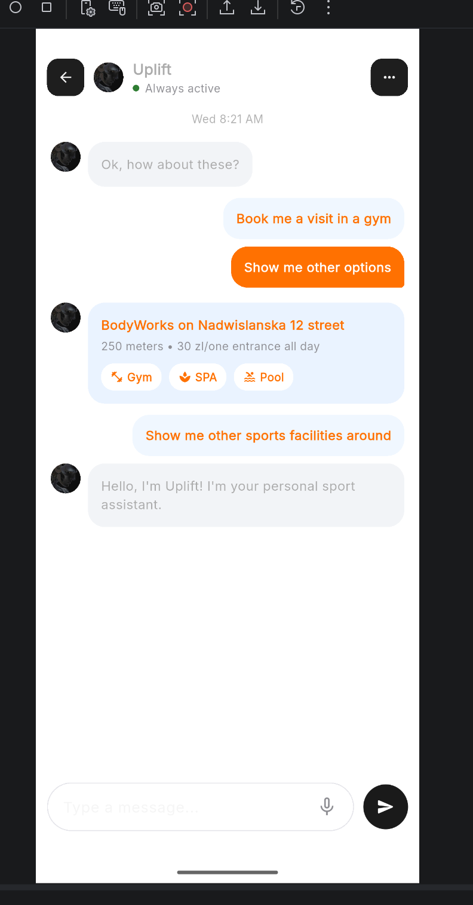 |

## Architecture

```
lib/
  core/
    network/     ApiClient, TokenRefreshService, TokenStorage, ApiException
    offline/     OfflineCache (Hive), OfflineStatus + OfflineBanner
    di/          app_providers.dart — all HTTP repositories
    router/      GoRouter + auth redirects
  features/*/
    domain/      entities, repository contracts, use cases
    data/        Http*Repository (Dio → FastAPI)
    presentation/
backend/
  app/           router → service → repository → model
```

### Data flow

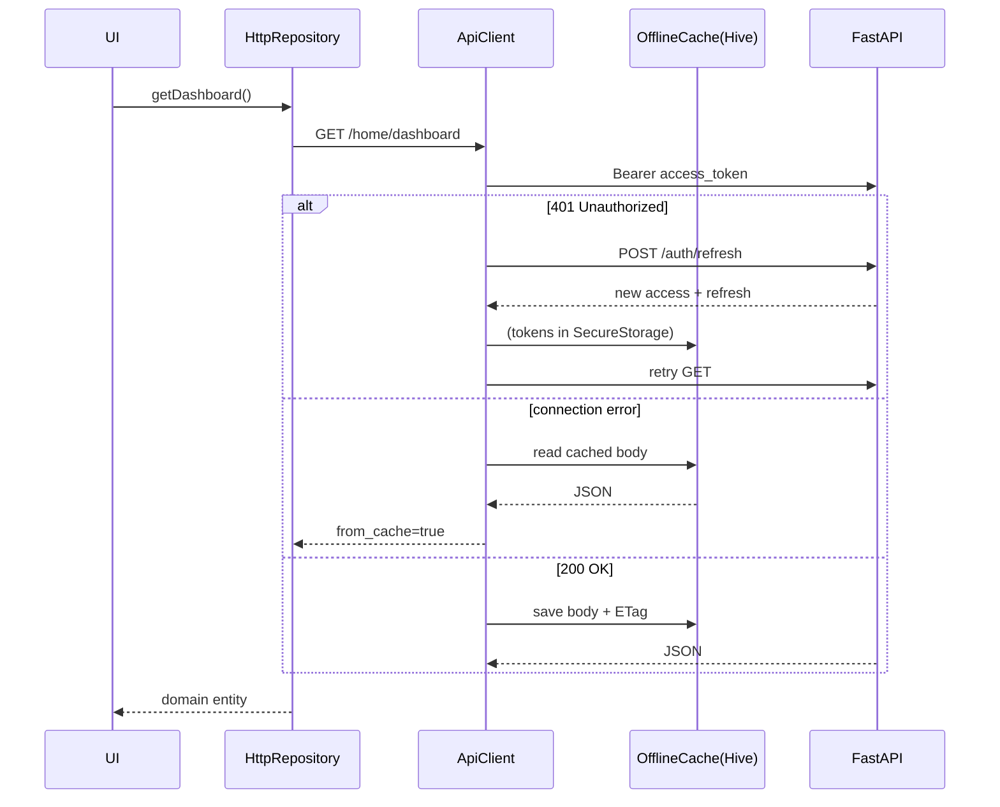

State management: **Provider**. Navigation: **GoRouter**.

## Prerequisites

- Flutter SDK 3.12+
- Python 3.11+
- Backend on port `8000` (`backend/README.md`)

## Backend setup

```bash
cd backend
python -m venv .venv && source .venv/bin/activate
pip install -r requirements.txt
alembic upgrade head
uvicorn app.main:app --reload --port 8000
```

OpenAPI: http://127.0.0.1:8000/docs  
Base path: `/api/v1`

## Flutter setup

```bash
flutter pub get
flutter run
```

| Platform | `API_BASE_URL` |
|----------|----------------|
| Desktop / iOS simulator | `http://127.0.0.1:8000/api/v1` (default) |
| Android emulator | `http://10.0.2.2:8000/api/v1` |

```bash
flutter run --dart-define=API_BASE_URL=http://10.0.2.2:8000/api/v1
```

## Authentication

### JWT (email / password)

1. `POST /auth/register` or `POST /auth/login`
2. Store `access_token` + `refresh_token` in **flutter_secure_storage**
3. Dio injects `Authorization: Bearer …`
4. On **401**, `TokenRefreshService.rotateTokens()` calls `POST /auth/refresh`, saves the new pair, retries the request
5. `POST /auth/logout` revokes refresh tokens server-side; client clears storage

### OAuth2 / Google (OpenID Connect)

1. Sign-in screen → **Continue with Google**
2. Client sends ID token to `POST /auth/oauth/google`
3. Backend validates (or accepts `mock.<email>` when `oauth_allow_mock=true` for local/CI)
4. Backend issues the **same JWT access + refresh** pair as password login

Production: set `OAUTH_GOOGLE_CLIENT_ID` and pass a real Google ID token.

## Offline mode (Hive)

| Component | Role |
|-----------|------|
| `OfflineCache` | Hive box `uplift_offline_cache` — stores JSON body + ETag per path |
| `ApiClient` | On successful GET → `saveResponse`; on connection error → serve cache |
| `OfflineStatus` / `OfflineBanner` | UI signal when data came from Hive |

Flow:

1. Online GET 200 → write Hive (`body:` + `etag:`)
2. Later GET with `If-None-Match` → 304 → decode Hive body
3. No network → `DioExceptionType.connection*` → Hive fallback + orange banner

## REST APIs used by screens

| Screen / feature | Endpoints |
|------------------|-----------|
| Sign in / up / reset | `/auth/login`, `/register`, `/password-reset`, `/oauth/google` |
| Home | `GET /home/dashboard` |
| Search | `GET /search`, `/search/suggestions` |
| Assessment | `GET /assessment/config`, `GET/PUT /users/me/assessment` |
| Workouts | `/workouts/browse`, `/categories/{id}`, `/workouts/{id}`, `…/complete` |
| Nutrition | `/meals/draft`, `/meals/scan`, `POST /meals` |
| Stats | `/stats/hydration`, `/heart-rate`, `/calories`, `/uplift-score` |
| Activities | `/activities/status`, `/directions`, create/complete |
| Coach | `/coach/hub`, `/coach/chats`, `/chats/{id}/messages` |
| Profile | `/users/me` + assessment + calorie intake |
| Settings | `/settings`, `/notifications` |

## Tests

```bash
flutter test
cd backend && pytest -q
```

Coverage includes repository unit tests (`http_mock_adapter`), `TokenRefreshService`, Hive offline fallback, and Google OAuth exchange.

## CI

`.github/workflows/ci.yml` — `flutter analyze --no-fatal-infos`, `flutter test`, backend `pytest` (with `SECRET_KEY`).

## Lint

`analysis_options.yaml` includes `flutter_lints` plus project rules (`prefer_const_constructors`, `avoid_print`, …).
